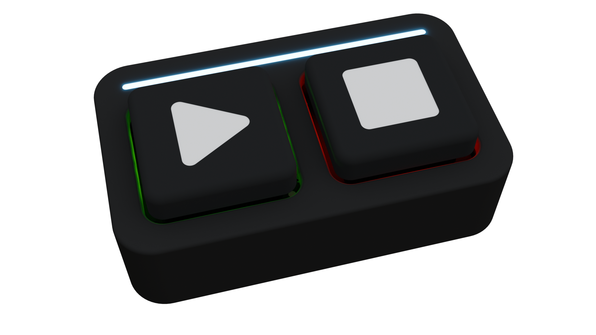
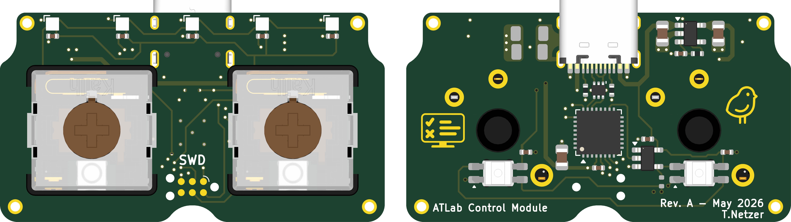

# ATLab - Control Module

A two‑button control interface that mounts directly to the test fixture using interchangeable custom backplates.
It provides a simple start/stop input for executing test jobs.

While the LED status bar indicates the current test state:
- Idle
- Pass
- Fail
- Running
- Cancelled

Each button also has individually adjustable backlighting that can signal when operator action is required.

**Docs:**  
- [Schematic](docs/ATLabControlModule%20-%20Schematic.pdf)
- [Assembly Drawing](docs/ATLabControlModule%20-%20Assembly%20Drawing.pdf)

